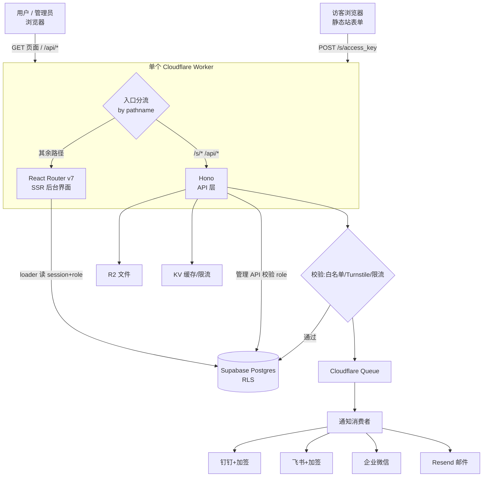

# FormStream 开发文档

> 基于 **Cloudflare Workers（单 Worker）+ Supabase** 的表单后端服务（Formspree / Web3Forms 国产化对标），核心差异点是**原生支持钉钉 / 飞书 / 企业微信通知**。**多租户**，用户自助注册；**管理员功能整合在同一后台**，按角色显隐。

| 项目 | 内容 |
|---|---|
| 文档版本 | **v1.2**（变更见文末「修订记录」） |
| 状态 | M1–M4 已实现并部署（计费订阅 / 境内栈适配暂缓） |
| 适用对象 | 后端 / 全栈开发、前端、运维 |
| 前端模板 | **React Router Framework Starter**（`cloudflare/templates/react-router-starter-template`） |
| 技术栈 | Cloudflare Workers / R2 / KV / Queues / Turnstile + React Router v7(SSR) + Hono + Supabase(Postgres/Auth) + Resend |
| 部署形态 | **单个 Worker**：React Router SSR + API 同体，**不使用 Pages** |
| 目标市场 | **海外独立站优先**（境内访问见 §12 风险） |

---

## 目录

1. 项目概述
2. 系统架构（单 Worker）
3. 技术栈与职责
4. 核心数据流
5. 角色与权限模型（多租户 + 管理员）
6. 功能模块详述
7. 数据模型（DB Schema）
8. API 设计（含 `/api/admin/*`）
9. 通知渠道集成
10. 安全设计
11. **边界与限制**（重点）
12. 部署与环境配置（React Router 模板）
13. 风险与待决事项
14. 开发里程碑
15. 附录 / 修订记录

---

## 1. 项目概述

### 1.1 背景

Formspree / Web3Forms 让纯静态网站无需自建后端就能接收表单并收到通知，默认走邮件。本项目差异化：**通知以国内 IM（钉钉 / 飞书 / 企业微信）为一等公民**，并把裸 webhook 做不好的脏活（加签、限流、重试、去重、留存）封装好。

### 1.2 形态决策（v1.1 更新）

- **单 Worker 全包**：React Router v7 负责后台界面的 SSR 与路由，同一个 Worker 用 Hono 处理公开表单端点与管理 API；静态资源走 Workers Static Assets。**Pages 不再使用**（Workers 已与 Pages 在静态资源 / SSR / 自定义域名上对等）。
- **多租户**：任意用户可注册、各自管理自己的表单与数据，RLS 隔离。
- **管理员整合**：管理员账号**单独配置**，与普通用户**共用同一登录入口**；登录后前端按角色额外渲染「管理面板」，后端用独立的 `/api/admin/*` 端点 + 角色校验提供跨租户能力。

### 1.3 核心价值主张

| 痛点 | 方案 |
|---|---|
| 静态站没后端 | 一个 `access_key`，零后端代码 |
| 国内邮件到达率差 | 直推钉钉 / 飞书 / 企业微信 |
| IM 裸 webhook 要自己加签扛限流 | 服务端统一加签 + 队列重试 |
| 数据没处存 | Supabase 持久化 + 后台查看 |
| 被刷垃圾 | Turnstile + 蜜罐 + 限流 |
| 平台无统一管理 | 管理员后台:用户/表单/用量/监控一处管 |

---

## 2. 系统架构（单 Worker）



### 2.1 入口分流（关键实现点）

Worker 的 `fetch` 入口先看路径：`/s/*` 与 `/api/*` 交给 Hono（API），其余交给 React Router 的 SSR 请求处理器。**公开表单端点必须走 Hono**，因为它要接受任意 `Content-Type`、动态设置 CORS、返回 302/JSON，不适合放进 React Router 的页面路由。

```ts
// workers/app.ts （概念示例）
import { createRequestHandler } from "react-router";
import apiApp from "./api";            // Hono 实例

const handleSSR = createRequestHandler(/* build, mode */);

export default {
  async fetch(request: Request, env: Env, ctx: ExecutionContext) {
    const { pathname } = new URL(request.url);
    if (pathname.startsWith("/s/") || pathname.startsWith("/api/")) {
      return apiApp.fetch(request, env, ctx);
    }
    return handleSSR(request, { cloudflare: { env, ctx } });
  },
} satisfies ExportedHandler<Env>;
```

---

## 3. 技术栈与职责

| 组件 | 选型 | 职责 |
|---|---|---|
| 运行时 / 入口 | **Cloudflare Workers** | 单 Worker 承载全部 |
| 后台界面 | **React Router v7（SSR, framework 模式）+ Tailwind** | 用户后台 + 管理面板，同源渲染 |
| API 层 | **Hono** | 公开端点 `/s/*`、管理 API `/api/*`、`/api/admin/*` |
| 关系数据 | **Supabase Postgres** | 多租户数据 + RLS |
| 认证 | **Supabase Auth** + `@supabase/ssr` | 注册/登录；SSR loader 里读 cookie session |
| 文件 | **Cloudflare R2** | 表单附件 |
| 缓存/限流 | **Cloudflare KV** | access_key→form 缓存、限流计数 |
| 异步通知 | **Cloudflare Queues** | 通知派发 + 重试 |
| 防滥用 | **Cloudflare Turnstile** | 人机验证（免费） |
| 邮件 | **Resend** | 邮件通知（MailChannels 免费已停） |

依赖安装（脚手架之外）：`@supabase/supabase-js`、`@supabase/ssr`、`hono`。

---

## 4. 核心数据流

### 4.1 表单提交

1. 访客 `POST` 到 `https://<domain>/s/{access_key}`，入口分流到 Hono
2. 解析请求体（urlencoded / multipart / json）
3. 校验：表单存在且启用（KV 缓存，未命中回源）→ 域名白名单 → 蜜罐 → Turnstile（如开）→ KV 限流
4. 文件流式写 R2，记录元数据
5. 写 `submissions`（service_role key，写前已校验 access_key 归属）
6. 累加 `usage` 月度计数
7. 投递 Queue → **立即返回**（302 跳转 或 200 JSON）
8. 通知消费者按渠道派发（加签 / 限流 / 重试）

### 4.2 后台访问（含角色）

用户/管理员 → 同一登录页（Supabase Auth）→ React Router loader 在 SSR 阶段用 `@supabase/ssr` 读 cookie session 与 `profiles.role`：
- 未登录 → 重定向登录页
- `role = user` → 渲染用户后台；访问 `/admin/*` → 403/首页
- `role = admin` → 额外渲染「管理面板」入口与页面

后台数据写改走 `/api/*`（用户域，RLS）或 `/api/admin/*`（管理员域，service key + 角色校验）。

---

## 5. 角色与权限模型（多租户 + 管理员）

### 5.1 角色

| 角色 | 能力 |
|---|---|
| `user`（默认） | 自助注册；仅管理**自己**的表单、提交、通知渠道；查看自己的用量 |
| `admin` | 平台管理员；跨租户查看与管理用户 / 表单 / 用量 / 系统监控 |

### 5.2 管理员如何「单独配置」

权威来源是 `profiles.role`。两种设定方式，按优先级：

1. **引导/兜底**：Worker secret `ADMIN_EMAILS`（逗号分隔）。用户登录时若邮箱命中且当前非 admin，则在 `profiles` 中提升为 `admin`。用于首个管理员初始化，避免"先有鸡还是先有蛋"。
2. **日常增减**：管理员在管理面板里改其他用户的 `role`，或直接在 Supabase 控制台改 `profiles.role`。

> 普通用户与管理员**共用同一登录入口**。是否显示管理菜单完全由 `role` 决定，不做独立登录页。

### 5.3 管理面板功能（整合在同一后台）

| 模块 | 功能 |
|---|---|
| 用户管理 | 列出全部用户、搜索；查看套餐/用量；停用/启用（`status`）；调整套餐；删除 |
| 全局表单 | 跨租户检索表单；强制停用滥用表单 |
| 全局提交概览 | 系统级提交量、垃圾拦截统计、Top 表单 |
| 系统监控 | 通知投递成功率、队列积压、错误率 |
| 平台设置 | 各套餐默认配额等系统级配置 |

### 5.4 权限实现（双层守卫）

- **前端（SSR loader）**：在 `/admin/*` 的父路由 loader 里校验 `role === 'admin'`，否则 `throw redirect`。仅作体验层，不作安全边界。
- **后端（安全边界）**：`/api/admin/*` 每个端点先验 JWT → 查 `profiles.role` 与 `status` → 非 admin 返回 403 → 通过后用 **service_role key** 执行跨租户查询（绕 RLS）。
- **RLS 不开「admin 全局例外」**：管理员的全局能力**只**经服务端 admin 端点 + service key 实现，便于审计与收口，避免在 RLS 里散落特权逻辑。

---

## 6. 功能模块详述

### 6.1 表单接收（核心）
多 Content-Type；保留字段 `_redirect` / `_subject` / `_honey` / `cf-turnstile-response`；其余字段原样入 `data`；文件入 R2。

### 6.2 通知系统
每表单可配多渠道（钉钉/飞书/企微/邮件/通用 Webhook）；异步、独立、失败指数退避重试。

### 6.3 反滥用
域名白名单 + 蜜罐 + Turnstile + KV 限流（表单/IP 双维度）+ 可选关键词过滤。

### 6.4 文件上传
R2 存储，控制台用短时效签名 URL 下载。

### 6.5 用户后台
表单 CRUD / 通知渠道（含一键测试）/ 提交记录（分页、搜索、导出 CSV、删除、标记垃圾）/ 用量。

### 6.6 管理面板
见 §5.3，复用同一套 UI 框架与组件，按角色挂载路由。

### 6.7 认证
注册 / 登录 / 邮箱验证 / 找回密码 → Supabase Auth；SSR 用 `@supabase/ssr` 读 session。

---

## 7. 数据模型（Supabase Postgres）

### 7.1 ER 概览

```
auth.users
   └─ profiles (1:1，role / status / plan)
        └─ forms (1:N)
             ├─ notification_channels (1:N)
             └─ submissions (1:N)
   └─ usage (按月)
   └─ audit_logs (管理员/系统操作留痕，actor_id 关联用户，删用户时置空)
```

### 7.2 DDL

```sql
create table public.profiles (
  id          uuid primary key references auth.users(id) on delete cascade,
  role        text not null default 'user'   check (role in ('user','admin')),
  status      text not null default 'active'  check (status in ('active','suspended')),
  plan        text not null default 'free',   -- free / pro / business
  created_at  timestamptz not null default now()
);

create table public.forms (
  id              uuid primary key default gen_random_uuid(),
  user_id         uuid not null references auth.users(id) on delete cascade,
  name            text not null,
  access_key      text not null unique default encode(gen_random_bytes(16),'hex'),
  allowed_domains text[] not null default '{}',
  is_active       boolean not null default true,
  turnstile_enabled boolean not null default false,
  redirect_url    text,
  spam_protection boolean not null default true,
  created_at      timestamptz not null default now(),
  updated_at      timestamptz not null default now()
);
create index idx_forms_user on public.forms(user_id);

create table public.notification_channels (
  id          uuid primary key default gen_random_uuid(),
  form_id     uuid not null references public.forms(id) on delete cascade,
  type        text not null check (type in ('dingtalk','feishu','wework','email','webhook')),
  config      jsonb not null,        -- {webhook_url, secret, emails:[], ...}
  is_active   boolean not null default true,
  created_at  timestamptz not null default now()
);
create index idx_channels_form on public.notification_channels(form_id);

create table public.submissions (
  id          uuid primary key default gen_random_uuid(),
  form_id     uuid not null references public.forms(id) on delete cascade,
  data        jsonb not null,
  files       jsonb not null default '[]',
  ip          inet,
  user_agent  text,
  country     text,
  is_spam     boolean not null default false,
  created_at  timestamptz not null default now()
);
create index idx_sub_form_created on public.submissions(form_id, created_at desc);

create table public.usage (
  user_id     uuid not null references auth.users(id) on delete cascade,
  period      date not null,
  count       integer not null default 0,
  primary key (user_id, period)
);

create table public.audit_logs (
  id          uuid primary key default gen_random_uuid(),
  actor_id    uuid references auth.users(id) on delete set null,  -- 系统事件可为空
  actor_email text,
  action      text not null,        -- user.update / user.delete / form.force_disable / channel.delivery_failed ...
  target_type text not null,        -- user / form / notification_channel ...
  target_id   text,
  detail      jsonb not null default '{}',
  created_at  timestamptz not null default now()
);
create index idx_audit_logs_created on public.audit_logs(created_at desc);

-- 注册后自动建 profile
create function public.handle_new_user() returns trigger language plpgsql security definer as $$
begin
  insert into public.profiles (id) values (new.id);
  return new;
end; $$;
create trigger on_auth_user_created
  after insert on auth.users for each row execute function public.handle_new_user();
```

### 7.3 RLS（仅普通用户域）

```sql
alter table public.forms enable row level security;
alter table public.submissions enable row level security;
alter table public.notification_channels enable row level security;
alter table public.profiles enable row level security;
alter table public.usage enable row level security;
alter table public.audit_logs enable row level security;
-- audit_logs 不建任何 policy：RLS 默认拒绝所有人，只有 service_role（绕 RLS）能读写

create policy "own profile" on public.profiles
  for select using (auth.uid() = id);

create policy "own forms" on public.forms
  for all using (auth.uid() = user_id);

create policy "own submissions" on public.submissions
  for all using (exists (
    select 1 from public.forms f
    where f.id = submissions.form_id and f.user_id = auth.uid()));

create policy "own channels" on public.notification_channels
  for all using (exists (
    select 1 from public.forms f
    where f.id = notification_channels.form_id and f.user_id = auth.uid()));

create policy "own usage" on public.usage
  for select using (auth.uid() = user_id);
```

> 管理员的跨租户访问**不**写进 RLS；统一走 §8.3 的 admin 端点 + service_role key。
> 公开端点写 `submissions` 用 service_role key，写前在 Hono 里手动校验 `access_key→form`。

---

## 8. API 设计

### 8.1 公开端点（无需登录）

#### `POST /s/:accessKey`
任意 Content-Type；保留字段见 §6.1。响应：普通提交 `302`→`redirect_url`/默认成功页；AJAX（`Accept: application/json`）→ `200 {"success":true,"id":"..."}`。

### 8.2 用户 API（需 Supabase JWT，走 RLS）

| 方法 | 路径 | 说明 |
|---|---|---|
| POST | `/api/forms` | 创建表单 |
| GET | `/api/forms` | 我的表单列表 |
| GET/PATCH/DELETE | `/api/forms/:id` | 表单详情/更新/删除 |
| GET | `/api/forms/:id/submissions?page=&size=` | 提交记录分页 |
| GET | `/api/forms/:id/submissions/export` | 导出 CSV |
| DELETE | `/api/submissions/:id` | 删除提交 |
| POST | `/api/forms/:id/channels` | 新增通知渠道 |
| GET | `/api/forms/:id/channels` | 表单的通知渠道列表 |
| DELETE | `/api/channels/:id` | 删除通知渠道 |
| POST | `/api/channels/:id/test` | 测试通知 |
| GET | `/api/me` | 我的 profile（套餐/角色/状态） |
| GET | `/api/me/usage` | 我的用量 |

### 8.3 管理员 API（需 `role=admin`，service key）

| 方法 | 路径 | 说明 |
|---|---|---|
| GET | `/api/admin/users?page=&q=` | 用户列表/搜索 |
| GET | `/api/admin/users/:id` | 用户详情(套餐/用量/表单数) |
| PATCH | `/api/admin/users/:id` | 改 `plan` / `status`(停用启用) / `role` |
| DELETE | `/api/admin/users/:id` | 删除用户(连带清理其 R2 附件) |
| GET | `/api/admin/forms?q=` | 全局表单检索 |
| PATCH | `/api/admin/forms/:id` | 强制 `is_active` 切换 |
| GET | `/api/admin/stats` | 系统概览(用户数/提交量/垃圾率 + 近14天趋势 + Top表单) |
| GET | `/api/admin/usage` | 用量汇总 |
| GET | `/api/admin/logs?page=&size=` | 操作审计日志(管理员操作 + 渠道永久失败) |

每个 admin 端点统一前置中间件：验 JWT → 查 `profiles.role='admin' and status='active'` → 否则 403。

### 8.4 错误码

| HTTP | 含义 |
|---|---|
| 200/302 | 成功 |
| 400 | 参数/解析错误 |
| 401 | 未登录/JWT 失效 |
| 403 | 域名不允许 / 命中反垃圾 / 表单停用 / **非管理员访问 admin 端点** |
| 404 | 资源不存在 |
| 413 | 体/文件超限 |
| 429 | 限流 |
| 500 | 服务端异常 |
| 503 | 表单开启 Turnstile 但服务端未配置 `TURNSTILE_SECRET`（`TURNSTILE_UNAVAILABLE`） |

响应体：`{"success":false,"code":"FORBIDDEN","message":"..."}`。常见业务 `code`：`QUOTA_EXCEEDED`（套餐配额超限）、`PLAN_LIMIT`（文件上传套餐限制）、`RATE_LIMITED`、`TURNSTILE_UNAVAILABLE`。

---

## 9. 通知渠道集成

> 限流与加签以各平台官方最新文档为准。

### 9.1 钉钉群机器人
端点 `https://oapi.dingtalk.com/robot/send?access_token=xxx`；加签：待签串 `{timestamp}\n{secret}`，`HmacSHA256`(key=secret) → base64 → urlEncode，URL 追加 `&timestamp=&sign=`；体 `{"msgtype":"text","text":{"content":"..."}}`；限流约 **20 条/分**，超限封约 10 分钟。

### 9.2 飞书群机器人
端点 `https://open.feishu.cn/open-apis/bot/v2/hook/xxx`；加签：`{timestamp}\n{secret}` 作 key 对空串 `HmacSHA256` → base64，`timestamp`/`sign` 放**请求体**；体 `{"msg_type":"text","content":{"text":"..."}}`；限流约 **100 条/分**。

### 9.3 企业微信群机器人
端点 `https://qyapi.weixin.qq.com/cgi-bin/webhook/send?key=xxx`；**无加签**，靠 `key`（当机密）；体 `{"msgtype":"text","text":{"content":"..."}}`；限流约 **20 条/分**。

### 9.4 邮件（Resend）
配 SPF/DKIM；模板含表单名、字段表、时间、来源 IP。

### 9.5 加签参考（WebCrypto）
> ⚠️ 钉钉与飞书加签的 **key/被签内容是相反的**，实现时极易写反（曾导致飞书渠道全部静默失败）：
> - **钉钉**：`HMAC(key = secret, msg = "{timestamp}\n{secret}")`，结果 base64 后 **urlEncode**，拼到 URL 查询参数 `&timestamp=&sign=`。
> - **飞书**：`HMAC(key = "{timestamp}\n{secret}", msg = 空串)`，结果 base64，`timestamp`/`sign` 放**请求体**。

```javascript
// 钉钉：被签内容是 timestamp\nsecret，key 是 secret
async function dingSign(secret, timestamp) {
  const key = await crypto.subtle.importKey('raw',
    new TextEncoder().encode(secret),
    { name: 'HMAC', hash: 'SHA-256' }, false, ['sign']);
  const sig = await crypto.subtle.sign('HMAC', key,
    new TextEncoder().encode(`${timestamp}\n${secret}`));
  return encodeURIComponent(btoa(String.fromCharCode(...new Uint8Array(sig))));
}

// 飞书：key 是 timestamp\nsecret，被签内容是空串
async function feishuSign(secret, timestamp) {
  const key = await crypto.subtle.importKey('raw',
    new TextEncoder().encode(`${timestamp}\n${secret}`),
    { name: 'HMAC', hash: 'SHA-256' }, false, ['sign']);
  const sig = await crypto.subtle.sign('HMAC', key, new Uint8Array(0));
  return btoa(String.fromCharCode(...new Uint8Array(sig)));
}
```

### 9.6 响应判定（重要：HTTP 200 不等于送达）
钉钉 / 飞书 / 企业微信即使消息被拒（加签错、限流、token 失效、关键词不匹配）**也返回 HTTP 200**，真正的成败在响应体的状态码字段里，必须解析判断，否则会把"被拒"误当"已送达"（曾是真实 bug）：

| 平台 | 成功标志 | 可重试码（限流/系统繁忙） | 典型永久失败码 |
|---|---|---|---|
| 钉钉 | `errcode === 0`（注意官方示例里可能是字符串 `"0"`，解析需容错） | `-1`(系统繁忙)、`90030`/`130101`/`410100`/`450101`(各版本限流码) | `310000`(加签/关键词)、`300005`(token) |
| 飞书 | `code === 0`（新）或 `StatusCode === 0`（旧机器人） | `99991400`/`11232`，以及 HTTP 429 | `19021`(加签失败) |
| 企业微信 | `errcode === 0` | `45009`(频率超限) | `40008`(消息格式错) |

- 通用 webhook：用户自有端点，响应体格式未知，只能按 HTTP 状态码判定（2xx 视为成功）。
- 可重试失败 → 交回队列指数退避重试；永久失败 → 不重试，写入 `audit_logs`（`action=channel.delivery_failed`）让用户/管理员能在 `/admin/logs` 看到。

---

## 10. 安全设计

| 项 | 措施 |
|---|---|
| access_key | 公开可见，靠白名单+Turnstile+限流防滥用，非机密 |
| IM secret / service_role key | 机密，仅 Worker secret 持有，绝不下发前端/进仓库 |
| 租户隔离 | 用户域走 RLS；公开写用 service key 但强校验归属 |
| 管理员越权访问 | 仅经 `/api/admin/*` + 角色中间件 + service key；前端守卫仅体验层 |
| 被停用账号 | `profiles.status='suspended'` 时拒绝登录态操作 |
| CORS | 公开端点按 `allowed_domains` 动态设 `Allow-Origin` |
| 文件 | R2 不公开，短时效签名 URL |
| 传输 | 全程 HTTPS |

---

## 11. 边界与限制（重点）

> 平台限额会变，**上线前核对各官方当前数值**。下为设计基线。

### 11.1 Cloudflare 平台

| 项 | Free | 付费(参考) | 影响 |
|---|---|---|---|
| Workers 请求 | ~10万/天 | 千万级 | 承载量级 |
| 单请求 CPU | ~10ms | 可至 30s | 通知必须异步 |
| 请求体 | 100MB | 100MB | 单次上传上限 |
| 子请求 | 50/请求 | 1000/请求 | 多渠道派发用队列分散 |
| Queues | 1万 operations/天，保留期固定24h | 100万 operations/月，保留期可配至14天 | Free 即可用，量大/需长保留期再升级 |
| R2 | 10GB 免费 | 按量 | 文件容量 |
| Turnstile | 免费 | 免费 | — |
| SSR | — | — | React Router SSR 每次渲染占 CPU，注意 loader 别做重活 |

### 11.2 Supabase 平台

| 项 | Free | Pro(参考) |
|---|---|---|
| DB | 500MB | 8GB 起 |
| 文件 | 1GB | 100GB 起 |
| 闲置 | **7 天暂停** | 不暂停 |
| Auth MAU | 数万 | 更高 |

> Free 档 7 天暂停，**不适合生产**，正式至少 Pro。连库走 supabase-js/REST，勿裸 TCP。

### 11.3 IM 渠道

| 渠道 | 限流(参考) | 加签 |
|---|---|---|
| 钉钉 | ~20/分，超限封~10分钟 | 需要 |
| 飞书 | ~100/分 | 需要 |
| 企业微信 | ~20/分 | 不需要 |

> 均有限流，**通知必须经队列削峰 + 退避重试**。

### 11.4 业务限制（按套餐）

| 维度 | Free | Pro | Business |
|---|---|---|---|
| 月提交 | 250 | 5,000 | 50,000 |
| 表单数 | 3 | 不限 | 不限 |
| 渠道/表单 | 1 | 5 | 不限 |
| 单文件 | 不支持 | 10MB | 25MB |
| 数据留存 | 30天 | 1年 | 不限 |

### 11.5 明确不做 / 暂不做
- 不做可视化拖拽表单搭建器（用户自带前端）
- MVP 不做在线支付/订阅计费（用量仅统计 + 软限制；套餐由管理员手动调）
- 不做复杂审批工作流
- 不保证境内访问质量（见 §13）

---

## 12. 部署与环境配置（React Router 模板）

### 12.1 脚手架
```bash
npm create cloudflare@latest formstream -- \
  --template=cloudflare/templates/react-router-starter-template
cd formstream
npm i @supabase/supabase-js @supabase/ssr hono
```
本地：`npm run dev`；部署：`npm run build && npm run deploy`；日志：`npx wrangler tail`。

### 12.2 建议结构
```
app/
  root.tsx
  routes/
    _index.tsx
    login.tsx
    dashboard.*          # 用户后台
    admin.*              # 管理面板(父路由 loader 守卫 role)
workers/
  app.ts                 # 入口分流: /s/ /api/ → Hono, 其余 → React Router
  api/                   # Hono: 公开端点 + /api/* + /api/admin/*
wrangler.json
```

> 实际目录结构以仓库根 `README.md` 的「项目结构」一节为准（这里只是设计期示意）。

### 12.3 wrangler 绑定（在模板基础上补）
```jsonc
{
  "assets": { "directory": "./build/client" },
  "r2_buckets": [{ "binding": "UPLOADS", "bucket_name": "formstream-uploads" }],
  "kv_namespaces": [{ "binding": "RATE_LIMIT", "id": "<id>" }],
  "queues": {
    "producers": [{ "binding": "NOTIFY_QUEUE", "queue": "formstream-notify" }],
    "consumers": [{ "queue": "formstream-notify", "max_batch_size": 10, "max_retries": 5 }]
  },
  "vars": { "SUPABASE_URL": "https://xxxx.supabase.co" }
}
```

### 12.4 机密（`wrangler secret put`）
| 名称 | 用途 |
|---|---|
| `SUPABASE_SERVICE_KEY` | 公开端点 / admin 端点写库（绕 RLS） |
| `SUPABASE_ANON_KEY` | 验用户 JWT / SSR 会话 |
| `RESEND_API_KEY` | 发邮件 |
| `TURNSTILE_SECRET` | 校验 Turnstile |
| `ADMIN_EMAILS` | 管理员引导邮箱（逗号分隔） |

### 12.5 部署步骤
1. Supabase 建项目 → 执行 §7 DDL / 触发器 / RLS
2. 建 R2 bucket、KV namespace、Queue
3. `wrangler secret put` 配机密（含 `ADMIN_EMAILS`）
4. `npm run build && npm run deploy`
5. 绑自定义域名
6. 用 `ADMIN_EMAILS` 中的邮箱注册并登录 → 自动成为首个管理员

---

## 13. 风险与待决事项

| 风险 | 说明 | 应对 |
|---|---|---|
| 境内访问质量 | Cloudflare/Supabase 均在境外 | 海外站无忧；境内 SME 需评估换腾讯云/阿里云 + ICP 备案 |
| Queues 免费额度有限 | Free 档 1万 operations/天，保留期固定24h | 量大或需更长重试窗口时升 Paid（$5/月起，100万/月） |
| Supabase 闲置暂停 | Free 7 天 | 生产用 Pro |
| 邮件到达率 | 需 SPF/DKIM | 主推 IM，邮件可选 |
| SSR 成本 | 后台 SSR 占 CPU | loader 轻量、可缓存、按需客户端渲染 |
| 管理员误操作 | 删用户/停表单不可逆 | 二次确认 + 操作日志（后续） |
| access_key 被刷 | 公开可见 | 白名单+Turnstile+限流必开 |
| 合规 | 境内 SaaS 或涉备案/许可 | 法务确认后再开境内入口 |

---

## 14. 开发里程碑

| 阶段 | 范围 | 状态 |
|---|---|---|
| **M1 MVP** | 入口分流 + 公开端点(收+校验+写库) + 单渠道通知 + 注册登录 + 用户后台(建表单/看提交) | ✅ 已完成 |
| **M2** | 多渠道通知 + 加签 + 队列重试 + Turnstile + 限流 + 文件上传 | ✅ 已完成 |
| **M3** | **管理员角色 + 管理面板**(用户/全局表单/概览) + 套餐软限制 + 用量统计 + CSV 导出 + 渠道测试 | ✅ 已完成 |
| **M4** | 操作日志/审计 + 分析面板(提交趋势/Top表单) | ✅ 已完成 |
| **M4(暂缓)** | 计费订阅 + 境内栈适配(换云厂商/ICP 备案) | ⏸ 暂未做 |

---

## 15. 附录 / 修订记录

### 15.1 术语
access_key（表单公开标识，非机密）；群机器人/webhook；加签（HmacSHA256）；RLS（行级安全）；蜜罐；SSR（服务端渲染）；service_role key（绕 RLS 的服务端密钥）。

### 15.2 参考
Formspree / Web3Forms；Cloudflare Workers / Static Assets / R2 / KV / Queues / Turnstile 文档；React Router v7（framework 模式）文档；Supabase Auth / RLS / `@supabase/ssr` 文档；钉钉/飞书/企业微信自定义机器人文档。

### 15.3 修订记录
| 版本 | 变更 |
|---|---|
| v1.0 | 初稿（Vite+React + Pages 设想） |
| **v1.1** | 前端改 **React Router SSR 模板**；**去掉 Pages**，单 Worker 入口分流；明确**多租户**；新增**角色与权限模型(user/admin)**、管理面板、`/api/admin/*`、`profiles.role/status`、ADMIN_EMAILS 引导；部署改为 React Router 模板流程 |
| **v1.2** | 对齐实际发布的代码：§7 补 `audit_logs` 表 + RLS；§8 补 `/api/me`、`/api/forms/:id/channels`、`/api/admin/logs` 端点与 503 错误码；§9 新增「响应判定（HTTP 200≠送达，需解析 errcode/code）」并补全飞书加签示例与钉钉/飞书 key↔被签内容方向提醒；§14 标注 M1–M4 完成状态。部署流程已统一到仓库根 `README.md` |

---

*文档结束 · 实现前请核对各平台当前限额与接口规范。*
